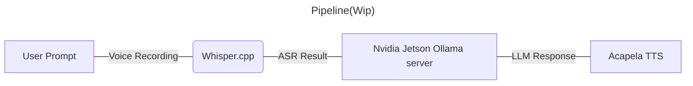

# QTo

Is a full on Conversation simulation for the Arcada robot QT, *Sötis*. 

[Whispercpp](https://github.com/ggerganov/whisper.cpp) for [QT robot](https://docs.luxai.com/docs/intro_code), integrated with ROS and external rPI 4 with [ReSpeaker](https://wiki.seeedstudio.com/ReSpeaker_4_Mic_Array_for_Raspberry_Pi/)



# Setup
| Device | Instances                | CounterSpecs                                          |
|--------|--------------------------|-------------------------------------------------------|
| QTPC   | ROS, QTo, Whisper.cpp    | Intel® NUC  i7 4-core @ 4.4GHz, 32 GB RAM, 512 GB SSD |
| QTRP   | ROS, Respeaker Mic Array | [Raspberry Pi 4](https://www.raspberrypi.com/products/raspberry-pi-4-model-b/), 4gb, 64gb eMMC                        |
| Jetson | Ollama                   | [Nvidia Jetson Orin Nano Developer Kit](https://www.nvidia.com/en-us/autonomous-machines/embedded-systems/jetson-orin/), 8gb, 1Tb PCIe 3.0     |

## Installing Whispercpp *Wip*

1. Create ROS project [LuxAI Documentation](https://docs.luxai.com/docs/tutorials/python/python_ros_project)
2. Clone Whispercpp into project
3. Build (and test Whispercpp)
4. Use files in this repo
5. Create or ask for `env.py` for local variables
    - Make sure IP to Jetson Nano Orin is correct and both the robot and the Jetson Orin Nano are on the same network.
6. Run ~~`main`~~ `test.py` file 

# LLM
- Local Large Language Models are being run through [Ollama](https://github.com/ollama/ollama) in [Jetson container](https://www.jetson-ai-lab.com/tutorial_ollama.html)/*Tailored Docker*
    - Currently using Llama 3 7B

# Data collection

Data is currently **ALWAYS** collected.

## Event tracking


```Python
tracking = EventTracker
tracking.start()
...
tracking.addEvent(str("action"), str("message"))
...
tracking.stop()
```

Logs are then saved in the following format:

| Timestamp  | Action | Counter | Message        | User   |
|------------|--------|---------|----------------|--------|
| 1724321234 | Prompt | 1       | "Who are you?" | uuid_1 |

Data log is aggregated in another github project [QTo_Analytics](https://github.com/qt-reachy/QTo_Analytics)

## Recordings

Recording is done over LuxAI ROS package and [Respeaker Mic Array](https://wiki.seeedstudio.com/ReSpeaker_Mic_Array_v2.0/).

All recordings are saved into seperate files for data collection.

# WIP
- Use through tablets and LuxAI Studio
- Clean TTS, currently LLM reply is too verbose for ROS Acapela functionality.
- Ollama tools & RAG
    - Await Jetson container update for Llama 3.1 and tools functionality
    - Compare with Vector creation and RAG
- Toggle Data collection
- ~~Integrate brain using LLM and Jetson Orin Nano~~
- ~~Analytics~~


## issues
### Major
- Llama3 is *slow*
    - Explore *faster* Jetson containers [Small LLM](https://www.jetson-ai-lab.com/tutorial_slm.html) & [NanoLLM](https://www.jetson-ai-lab.com/tutorial_nano-llm.html)
    - ~~Use lighter models, like Phi3 is another alternative~~
        - New Phi 3.5, should be investigated

### Minor
- Whispercpp is run through bash
    - On ice for now due to lack of good Python wrappers and seemingly no hinderance
- Currently only prompting first line of Whispercpp ASR response
    - Is there a Python library that I am missing?
- Using absolute paths on QT
- LLM reply is wrong format
    - Explored grammar, not available in Ollama...
    - Upcoming toolbox with newer models
- Eventtracking could be automated?
